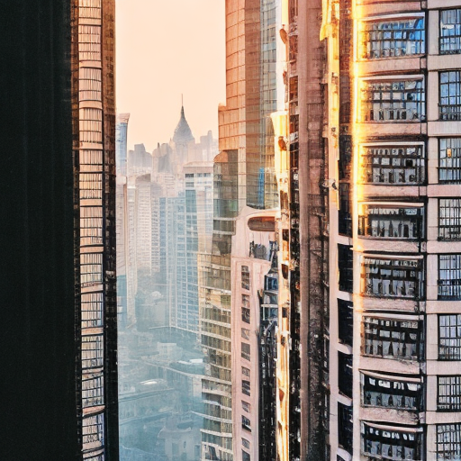
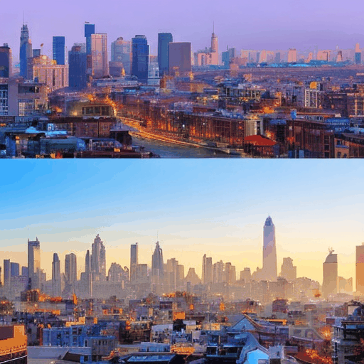
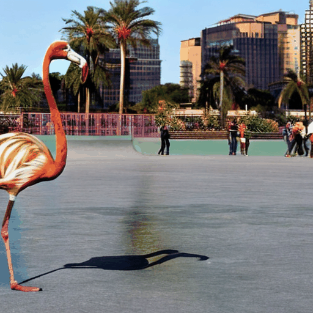

# Delta Denoising Score
An unofficial reimplementation of [Delta Denoising Score (DDS)](https://delta-denoising-score.github.io/).

# Results

```
"A city view in the morning"
↓
"A city view at night with batman symbol in the sky"
```

update | input image | output image
:-: | :-: | :-: 
 |  | 
 |  | 


```
"A cat sitting on the floor"
↓
"A cat wearing a red tie"
```

update | input image | output image
:-: | :-: | :-: 
 |  | 
 |  | 


```
"A flamingo is roller-skating in the city"
↓
"A peacock is roller-skating in the city"
```

update | input image | output image
:-: | :-: | :-: 
 |  | 
 |  | 

